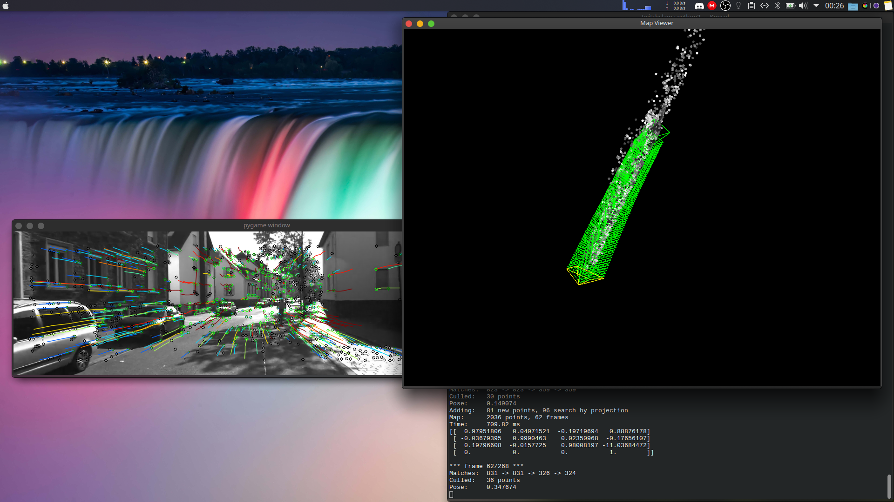

# SlamTrying

## Slamming Example as a Beginner 

under maintance heavily




## how to run

on linux;

installing requirements;
```sh
~$ pip3 install -r requirements.txt
```

after all installation done you need to install opengl lib and sdl2 lib to your system which not available with pip

for ubuntu/debian
```sh
~$ sudo apt install pyopengl python3-sdl2
```

and pandolin (use official repo [installation guide](https://github.com/uoip/pangolin)) 

after all req installation done use 
```sh
~$ chmod +x slam.py
```

and to run

```sh
~$ ./slam.py
```

ENJOY!!! 😄
